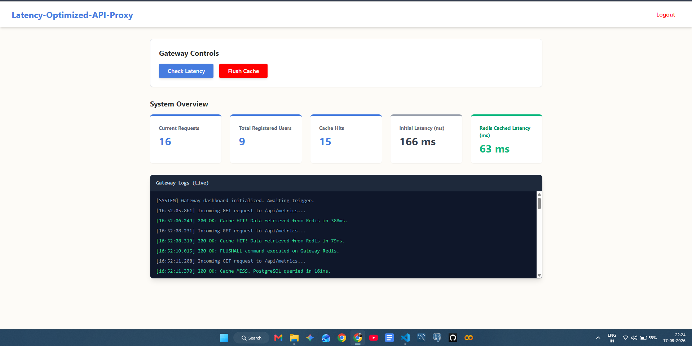

# Cloud-Native Performance Dashboard (Frontend)

A lightning-fast, responsive user interface built with React, TypeScript, and Vite. It serves as the control center for the Latency-Optimized API Proxy, securely authenticating users and visualizing real-time cache telemetry, hit/miss ratios, and system latency.



---

### Prerequisites
Make sure you have Node.js and npm installed. To view live metrics, ensure the Gateway and Backend services are running locally on your machine.

## Getting Started

### Installation

1. Clone the repository:
    ```bash
    git clone https://github.com/SaharshBhatnagar/Latency-Optimized-API-Proxy-frontend.git
    ```

2. Navigate to the project directory:

    ```Bash
    cd Latency-Optimized-API-Proxy-frontend
    ```

3. Install dependencies:

    ```Bash
    npm install
    ```

4. Create your environment file:

    Create a .env file in the root and add your API gateway target:

    ```Bash
    VITE_API_URL=http://localhost:8000
    ```

    > **Note**: Vite requires environment variables exposed to the client to be prefixed with `VITE_`. In your production AWS environment, this should point to your live gateway URL.

5. Start the development server:

    ```Bash
    npm run dev
    ```

## Usage

### Production Build

1. Compile the TypeScript and build the React app:

    ```Bash
    npm run build
    ```

2. Preview the compiled production build locally:

    ```Bash
    npm run preview
    ```

## Docker Deployment

> This frontend is containerized using a multi-stage Dockerfile that builds the Vite application and serves the static assets via a high-performance Nginx web server.

The application can be run as a container by mapping the standard HTTP port:

```Bash
docker build -t latency-optimized-api-proxy-frontend .
docker run -p 80:80 latency-optimized-api-proxy-frontend
```

If you are running the full stack locally, use docker-compose:

```Bash
docker compose up -d frontend
```

## Directory Structure

```Plaintext
Latency-Optimized-API-Proxy-frontend/
├── .github/workflows/deploy.yml
├── src/
│   ├── components/          
│   │   ├── Dashboard.tsx    
│   │   └── LoginForm.tsx    
│   ├── services/            
│   │   └── authService.ts   
│   ├── App.tsx              
│   ├── index.css            
│   └── main.tsx             
├── Dockerfile               
├── nginx.conf               
├── package.json             
├── tailwind.config.js       
├── tsconfig.json            
└── vite.config.ts           
```

## CI/CD Pipeline

> This repository includes a `GitHub Actions workflow` (deploy.yml) that automatically builds the Docker image and pushes it to Amazon Elastic Container Registry (ECR) upon pushes to the main branch. Ensure your AWS IAM credentials (`AWS_ACCESS_KEY_ID` and `AWS_SECRET_ACCESS_KEY`) are stored safely in GitHub Repository Secrets.

## Additional Documentation

**Architecture Details**

> The production Docker image utilizes Nginx (`nginx.conf`) to serve the compiled static assets, ensuring optimal load times and proper routing for single-page application (SPA) client-side navigation.

**Tech Stack**: React, TypeScript, Vite, Tailwind CSS, Nginx, Docker, AWS (ECR, EC2)

### Full Architecture Stack

This frontend UI is one component of a complete cloud-native ecosystem. You can explore the other microservices in this architecture here:

* **API Gateway:** [Latency Optimized API Proxy Gateway](https://github.com/SaharshBhatnagar/Latency-optimized-API-Proxy-gateway)

* **Backend:** [Latency Optimized API Proxy Gateway Backend](https://github.com/SaharshBhatnagar/Latency-optimized-API-Proxy-backend)